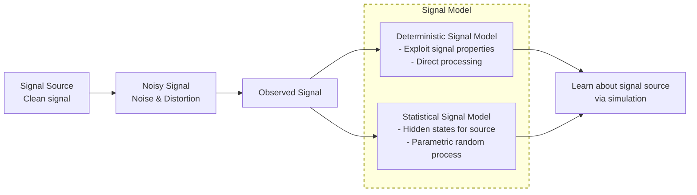
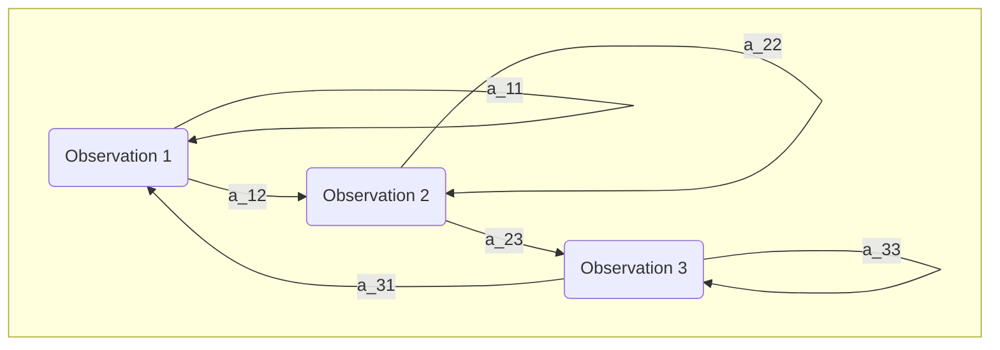

# Speech Recognition <br> (Spring DSAI 456)
## Lecture 5

Mohamed Ghalwash
<Email v="mghalwash@zewailcity.edu.eg" />

---
layout: top-title
---

:: title :: 

# Lecture 3 Recap 

:: content :: 
  
- GMM

---
layout: intro
---

# Gaussian Mixture Model

A weighted sum of Gaussian components used to model complex continuous distributions

---
layout: top-title
---

:: title :: 

# What is a GMM?

:: content :: 

- Density
$$
p(x)=\sum_{k=1}^K \pi_k \,\mathcal{N}(x\mid\mu_k,\Sigma_k) \\ 
\text{such that } \sum_{k=1}^K \pi_k = 1,\quad \pi_k \ge 0
$$

- Parameters: 
  - weight $\pi_k$
  - mean $\mu_k$
  - covariance $\Sigma_k$

---
layout: top-title
title: 
---

:: title :: 

# Parameter Estimation 

:: content :: 

### How to learn parameters of the GMM? 

- **Problem:** Parameters are multiplied 

$$p(x)=\sum_{k=1}^K \pi_k \,\mathcal{N}(x\mid\mu_k,\Sigma_k)$$

- **Solution:** Iterative algorithm 


---
layout: top-title
---

:: title :: 

# Responsibilities (soft assignments)

:: content ::

The responsibility $r_{nk}$ represents the probability that  $x_n$ has been generated by the $k^{th}$ component

<div class="grid w-full h-fit grid-cols-2 grid-rows-2 mt-2 mb-auto">
  <div class="grid-item grid-col-span-1"></div>
  <div class="grid-item grid-col-span-1"></div>
  <div class="grid-item grid-col-span-2 text-center h-fit">

$$
r_{nk} = \frac{\pi_k \,\mathcal{N}(x_n\mid\mu_k,\Sigma_k)}{\sum_{j=1}^K \pi_j \,\mathcal{N}(x_n\mid\mu_j,\Sigma_j)} \\ 
N_k = \sum_{k=1}^K r_{nk}
$$

  </div>
</div>


---
layout: top-title 
---

:: title :: 

# Optimization: Maximum Likelihood 

:: content :: 

- Full data likelihood


$$
\begin{aligned}
p(X\mid\theta) &=\prod_{n=1}^N p(x_n|\theta)  \\
\Rightarrow \log p(X\mid\theta) &= \log \prod_{n=1}^N p(x_n|\theta) \\
&= \sum_{n=1}^N  \log p(x_n|\theta)  \\  
\Rightarrow  \mathcal{L} &= \sum_{n=1}^N  \log p(x_n|\theta) + \lambda \Big(\sum_{k=1}^{K}\pi_k - 1\Big) \\    
\end{aligned}
$$


---
layout: top-title 
---

:: title :: 

# Derivation: closed-form for $\pi_k$ (E-step)

:: content :: 

$${1|2|3|4|5|all}
\begin{aligned}
\frac{\partial \mathcal{L}}{\partial \pi_j}
&= \sum_{n=1}^N \frac{\partial \log p(x_n|\theta)}{\partial \pi_j}  + \lambda \\ 
&= \sum_{n=1}^N \frac{1}{p(x_n|\theta)} \frac{\partial \textcolor{green}{p(x_n|\theta)}}{\partial \pi_j}  + \lambda\\ 
&= \sum_{n=1}^N \frac{1}{p(x_n|\theta)} \frac{\partial \textcolor{green}{\sum_{k=1}^K \pi_k \,\mathcal{N}(x_n\mid\mu_k,\Sigma_k)}}{\partial \pi_j} + \lambda \\ 
&= \sum_{n=1}^N \frac{1}{\textcolor{red}{p(x_n|\theta)}} \mathcal{N}(x_n\mid\mu_j,\Sigma_j) + \lambda \\ 
&= \sum_{n=1}^N \frac{\mathcal{N}(x_n\mid\mu_j,\Sigma_j)}{\textcolor{red}{\sum_{k=1}^K \pi_k \,\mathcal{N}(x_n\mid\mu_k,\Sigma_k)}}  + \lambda \\ 
\end{aligned}
$$


---
layout: top-title 
---

:: title :: 

# Derivation: closed-form for $\pi_k$ (E-step)

:: content :: 

$${1|2|3}
\begin{aligned}
\frac{\partial \mathcal{L}}{\partial \pi_j} 
&= \sum_{n=1}^N \frac{\mathcal{N}(x_n\mid\mu_j,\Sigma_j)}{\sum_{k=1}^K \pi_k \,\mathcal{N}(x_n\mid\mu_k,\Sigma_k)}  + \lambda \\ 
&= \frac{1}{\textcolor{blue}{\pi_j}}\sum_{n=1}^N \frac{\textcolor{blue}{\pi_j}\mathcal{N}(x_n\mid\mu_j,\Sigma_j)}{\sum_{k=1}^K \pi_k \,\mathcal{N}(x_n\mid\mu_k,\Sigma_k)}  + \lambda \\ 
&= \frac{1}{\pi_j}\sum_{n=1}^N r_{nj}  + \lambda \\ 
\end{aligned}
$$

$$
\begin{aligned}
\frac{\partial \mathcal{L}}{\partial \pi_j} = 0 \Rightarrow
\frac{1}{\pi_j}\sum_{n=1}^N r_{nj} &= -\lambda \Rightarrow
\pi_j = - \frac{1}{\lambda} \sum_{n=1}^N r_{nj} \\ 
\Rightarrow \boxed{\pi_j = - \frac{N_j}{\lambda}}
\end{aligned}
$$

---
layout: top-title 
---

:: title :: 

# Derivation: closed-form for $\lambda$ (E-step)

:: content :: 

$$
\mathcal{L} = \sum_{n=1}^N  \log p(x_n|\theta) + \lambda \Big(\sum_{k=1}^{K}\pi_k - 1\Big) 
$$

$$
\begin{aligned}
\frac{\partial \mathcal{L}}{\partial \lambda}
&= \sum_{k=1}^{K}\pi_k - 1 
\end{aligned}
$$

$$
\Rightarrow \sum_{k=1}^{K} \pi_k = 1
\xRightarrow {\pi_k = - \frac{N_k}{\lambda}} \sum_{k=1}^{K}  - \frac{N_k}{\lambda}  = 1 \\ 
\Rightarrow \lambda = - \sum_{k=1}^{K}  N_k = -N
\Rightarrow \boxed{\pi_j = \frac{N_j}{N}}
$$ 


---
layout: top-title 
---

:: title :: 

# Derivation: closed-form for $\mu_k$ (M-step)

:: content :: 

$$
\mathcal{L} = \sum_{n=1}^N  \log p(x_n|\theta) + \lambda \Big(\sum_{k=1}^{K}\pi_k - 1\Big) 
$$

$$
\begin{aligned}
\frac{\partial \log p(X\mid\theta)}{\partial \mu_j}
&= \sum_{n=1}^N \frac{\partial \log p(x_n|\theta)}{\partial \mu_j} \\ 
&= \sum_{n=1}^N \frac{1}{p(x_n|\theta)} \frac{\partial p(x_n|\theta)}{\partial \mu_j} \\ 
&= \sum_{n=1}^N \frac{1}{p(x_n|\theta)} \frac{\partial \sum_{k=1}^K \pi_k \,\mathcal{N}(x_n\mid\mu_k,\Sigma_k)}{\partial \mu_j} \\ 
&= \sum_{n=1}^N \frac{1}{p(x_n|\theta)} \frac{\partial \pi_j \,\mathcal{N}(x_n\mid\mu_j,\Sigma_j)}{\partial \mu_j} 
\end{aligned}
$$


---
layout: top-title 
---

:: title :: 

# Derivation: closed-form for $\mu_k$ (M-step)

:: content :: 

$$
\begin{aligned}
\frac{\partial \log p(X\mid\theta)}{\partial \mu_j}
&= \sum_{n=1}^N \frac{1}{p(x_n|\theta)} \frac{\partial \pi_j \,\mathcal{N}(x_n\mid\mu_j,\Sigma_j)}{\partial \mu_j} \\
&= \sum_{n=1}^N \frac{1}{p(x_n|\theta)} \pi_j (x_n-\mu_j)^T \Sigma_j^{-1} \mathcal{N}(x_n\mid\mu_j,\Sigma_j) \\ 
&= \sum_{n=1}^N \frac{1}{\sum_{k=1}^K \pi_k \,\mathcal{N}(x_n\mid\mu_k,\Sigma_k)} \pi_j (x_n-\mu_j)^T \Sigma_j^{-1} \mathcal{N}(x_n\mid\mu_j,\Sigma_j) \\ 
&= \sum_{n=1}^N  (x_n-\mu_j)^T \Sigma_j^{-1}  \frac{\pi_j \mathcal{N}(x_n\mid\mu_j,\Sigma_j)}{\sum_{k=1}^K \pi_k \,\mathcal{N}(x_n\mid\mu_k,\Sigma_k)} \\ 
&= \sum_{n=1}^N  (x_n-\mu_j)^T \Sigma_j^{-1}  r_{nj} \\ 
\end{aligned}
$$


---
layout: top-title 
---

:: title :: 

# Derivation: closed-form for $\mu_k$ (M-step)

:: content :: 

$$
\Rightarrow \sum_{n=1}^N  (x_n-\mu_j)^T \Sigma_j^{-1}  r_{nj} = 0 \\
\Big[ \sum_{n=1}^N  (r_{nj} x_n- r_{nj} \mu_j)^T \Big] \Sigma_j^{-1} = 0 \\
 \sum_{n=1}^N  r_{nj} x_n = \sum_{n=1}^N r_{nj} \mu_j \\
\mu_j =\frac{1}{\sum_{n=1}^N r_{nj}} \sum_{n=1}^N  r_{nj} x_n  \\
\boxed{\mu_j =\frac{1}{N_j} \sum_{n=1}^N  r_{nj} x_n } \\
$$

---
layout: top-title 
---

:: title :: 

# Derivation: closed-form for $\Sigma_k$ (M-step)

:: content :: 

$$
\boxed{\Sigma_k = \frac{1}{N_k} \sum_{n=1}^{N}r_{nk} (x_n - \mu_k)^T (x_n-\mu_k)}\\
$$

---
layout: top-title
---

:: title :: 

# Expectation-Maximization (EM)

:: content ::
<div class="ns-c-tight">

- Initialize $\pi_k, \mu_k, \Sigma_k$
- Loop until convergence 
  - E-step: Evaluate responsibilities $r_{nk}$ for every data point $x_n$ using current
parameters $\pi_k, \mu_k, \Sigma_k$
  $$
  r_{nk} = \frac{\pi_k \,\mathcal{N}(x_n\mid\mu_k,\Sigma_k)}{\sum_{j=1}^K \pi_j \,\mathcal{N}(x_n\mid\mu_j,\Sigma_j)}
  $$
  - M-step: Re-estimate parameters $\pi_k, \mu_k, \Sigma_k$ using the current responsibilities $r_{nk}$ (from E-step):
  $$
  \boxed{\pi_k = \frac{N_k}{N}}, 
  \boxed{\mu_k = \frac{1}{N_k} \sum_{n=1}^N  r_{nk} x_n}, 
  \boxed{\Sigma_k = \frac{1}{N_k} \sum_{n=1}^{N}r_{nk} (x_n - \mu_k)^T (x_n-\mu_k)}
  $$
  - Evaluate log-likelihood:
  $$
  \mathcal{L}=\sum_{n=1}^N \log\left(\sum_{k=1}^K \pi_k\mathcal{N}(x_n\mid\mu_k,\Sigma_k)\right)
  $$

</div>

```python
# python
# Simple EM loop skeleton (numpy)
for it in range(max_iters):
    # E-step: compute responsibilities (N x K)
    resp = compute_responsibilities(X, pis, mus, covs)
    Nk = resp.sum(axis=0)
    # M-step:
    pis = Nk / N
    mus = (resp.T @ X) / Nk[:, None]
    covs = update_covariances(X, mus, resp, Nk)
    if converged(): break
```

---
layout: top-title
---

:: title:: 

# Practical Consideration

:: content :: 

- **Choosing K:** cross-validation, AIC, BIC
$$\mathrm{BIC} = -2\log L + p\log N$$
- Initialize with k-means for faster convergence
- **Regularization:** floor covariances to avoid singularities (add $\epsilon I$)
- **Covariance choices:** full, tied, diagonal — trade-off accuracy vs. computation


---
layout: top-title
---

:: title:: 

# GMMs in Speech Recognition (Overview)

:: content :: 

- Treat each target class (e.g., a speaker identity) as a separate generative model $p(x | class)$
- Recognition chooses the class that maximizes the class-conditional likelihood given the observed acoustic features (or the cumulative likelihood across a window of frames)

```python
from sklearn.mixture import GaussianMixture
gmm = GaussianMixture(n_components=64, covariance_type='diag', ...)
gmm.fit(X)
ll = gmm.score_samples(X_test)
probs = gmm.predict_proba(X_test) # responsibilities (posteriors)
```

---
layout: intro
---

# Hidden Markov Models (HMM)


---
layout: top-title 
---

:: title :: 

# Motivation 

:: content :: 
    
**Source**: The actual phonemes or spoken words being uttered by a speaker

**Observed**: while the acoustic signal features or audio measurements recorded by a microphone.

<v-click>

- The observed signal may have noise so we need to build a signal model for the source
  - to design a system to remove noise and any transmission distortion 
  - to learn about the signal source (process that produced the signal) via simulation


</v-click>

---
layout: top-title 
---

:: title :: 

# (Observable) Markov Models

:: content :: 

- model is the set of states and transition probability matrix 
- we can compute $p(O|model)$, where $O$ is the sequence of [observation]{.decoration-4.underline.decoration-indigo-500}


---
layout: top-title 
---

:: title :: 

# Hidden Markov Models (HMM)

:: content :: 

- Double stochastic processes (one is hidden which is responsible for generating the process which is observable)

{style="margin:auto;width:100%;"}


---
layout: top-title
---

:: title :: 

# Elements of HMM

:: content :: 

{style="margin:auto;width:50%;"}

- states (hidden) $S$
- alphabets (observation symbols) $O$
- transition probability distribution $A$
- observation symbol probability (emission probability) $B$
- initial state distribution $\pi$


---
layout: top-title 
---

:: title :: 

# HMM Fundamental Problems: Speech Recognition Example

:: content :: 

<v-click at="1">

<div class="ns-c-tight">

1. **[Evaluation Problem]{.decoration-4.underline.decoration-green-500}**
   - Given an HMM model for a word (states = phonemes, probabilities learned)
   - Given an observed acoustic sequence $o$ (MFCC features)
   - Compute likelihood $p(o \mid \text{model})$ that the word model generated the audio
  </div>
<StickyNote color="green-light" textAlign="left" width="180px" v-drag="[760,125,180,80,0]">
Evaluate models on audio input to score likelihood
</StickyNote>
</v-click>

<v-click at="3">
<div class="ns-c-tight">

2. **[Decoding Problem]{.decoration-4.underline.decoration-amber-500}**
   - Given model and observed audio features
   - Find most likely phoneme state sequence that produced the audio (Viterbi)
</div>
<StickyNote color="amber-light" textAlign="left" width="180px" v-drag="[740,230,180,80,0]">
Decode best phoneme path to recognize speech content
</StickyNote>
</v-click>

<v-click at="2">
<div class="ns-c-tight">

3. **[Learning Problem]{.decoration-4.underline.decoration-blue-500}**
   - Given training acoustic sequences without phoneme labels
   - Estimate transition and emission probabilities to maximize data likelihood (Baum-Welch)
</div>
<StickyNote color="blue-light" textAlign="left" width="180px" v-drag="[830,320,140,100,0]">
Learn model parameters from training data to improve accuracy
</StickyNote>
</v-click>


---
layout: top-title 
---

:: title :: 

# Fundamental Problems for HMM

:: content :: 

1. **Evaluation problem**: Compute $p(o|\lambda)$ the probability of the observation sequence given the model $\lambda=\{A,B,\pi\}$
1. **Decoding problem**: Estimate the state sequence given observation sequence and the model 
1. **Learning problem**: Learn model parameters, i.e. $\argmax_{\lambda} p(o|\lambda)$
  
---
layout: cover
---

# Evaluation Problem of HMM

---
layout: top-title 
---

:: title :: 

# Evaluation Problem of HMM - Definition

:: content :: 

## Input
- Observation sequence $O = (o_1, o_2, \ldots, o_T)$
- HMM model $\lambda = (A, B, \pi)$ where
  - $A = \{a_{ij}\}$ transition probabilities
  - $B = \{b_j(o_t)=p(o_t|s_j)\}$ emission probabilities
  - $\pi = \{\pi_i\}$ initial state distribution

## Output
The likelihood $P(O \mid \lambda)$ which is the probability that model $\lambda$ produces $O$


---
layout: top-title 
---

:: title :: 

# Evaluation Problem of HMM - Direct Computation

:: content :: 

- The observation could be generated from ==any== possible state sequence $Q = (q_1, q_2, \ldots, q_T)$

<div style="width: 60%; margin: auto;">


</div>

<v-click> 

$$
\begin{align*}
P(O \mid \lambda) &= \sum_{all \, Q} P(O, Q \mid \lambda) \\
&= \sum_{all \, Q} P(O \mid Q, \lambda)P(Q|\lambda)
\end{align*}
$$

</v-click> 

<StickyNote color="red-light" textAlign="left" width="180px" v-drag="[730,220,180,100,20]">

There are $N^T$ possible state sequences
</StickyNote>


---
layout: top-title 
---

:: title :: 

# Evaluation Problem of HMM - Direct Computation

:: content :: 

<v-click>

$P(O \mid Q, \lambda) = b_{1}(o_1) \; . \; b_{2}(o_2) \; . \; b_{3}(o_3) \ldots b_{T}(o_T)$

$P(Q \mid \lambda) = \pi_1 \; . \; a_{12} \; . \; a_{23} \; . \; a_{34} \ldots a_{(T-1)T}$

Then 
$P(O, Q \mid \lambda) = \pi_{1} b_{1}(o_1) \prod_{t=2}^T a_{(t-1) t} b_{t}(o_t)$

</v-click>
<hr> 

<v-click>
<div class="ns-c-tight">

- Initially we are at time 1, we are in state $q_1$ with probability $\pi_{1}$
- Generate the symbol $o_1$ with probability $b_{1}(o_1)$
- Make a transition from state $q_1$ to state $q_2$ with probability $a_{12}$
- Generate the symbol $o_2$ with probability $b_{2}(o_2)$
- Continue until the last state 

</div>

</v-click>
<hr> 

<v-click>

==There are $N^T$ possible state sequences, each requires $2T$ calculations → exponential complexity==
</v-click>

---
layout: center
color: blue
--- 

## Can we find a faster algorithm to compute the likelihood? 


---
layout: center
class: text-center
---

# Learn More

[Course Homepage](https://github.com/m-fakhry/DSAI-456-SR)
