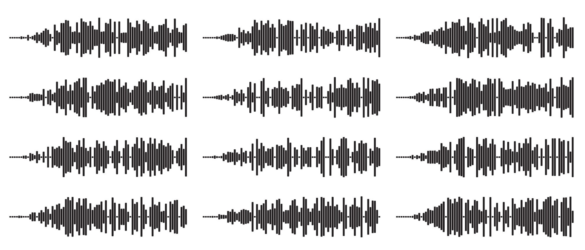

# Speech Recognition   (DSAI 456)
## Lecture 1: What is Speech System?

**Prof. Mohamed Ghalwash**  
<Email v="mghalwash@zewailcity.edu.eg" />
_Zewail City University_  

:: note ::

Lecture 1, Monday 21 September 2026

---
layout: top-title
color: sky-light
align: lt
title: Today
---

:: title ::

# Agenda

:: content ::

**Objectives**: you should be able to say what a speech system takes in and what it emits, compute the error rate of one by hand, and explain why a leaderboard number does not tell you whether the system works for your users.

- Problem: What does the machine actually receive, and why is turning it into text hard?
- Measurement: What is WER, what does it hide, and when is it the wrong metric?
- Course: How is this course run, and what does the project ask of you?

---
layout: grid-cards
cols: 3
---

# Core Speech Processing Tasks

Key functional modalities in modern speech AI systems.

:: card-1 ::

  ASR

  Automatic Speech Recognition

  Converts continuous acoustic audio signals into discrete text transcripts.

  Audio
  →
  Text

:: card-2 ::

  TTS

  Text-to-Speech

  Synthesizes human-like spoken audio waveforms directly from input text.

  Text
  →
  Audio

:: card-3 ::

  Speech LM

  Speech Language Models

  Generates speech directly from speech by preserving tone and emotion.

  Audio
  →
  Audio

---
layout: top-title
color: light
align: lt
title: What arrives
---

:: title ::

# What the Machine Actually Receives

:: content ::

<!-- Key Metric Callout Cards -->

  
  

    
Raw Input Stream

    
16,000 samples/sec

    
Continuous amplitude values (at 16 kHz)

  

  

    
Target Output

    
12–15 chars/sec

    
Discrete text characters per second

  

  

    
Scale Disparity

    
~1,000 : 1

    
Ratio of acoustic data points to output text

  

<!-- Waveform visual & Core Insight split -->

  
  

    

      <i class="carbon:wave-directional inline-block text-amber-500" />
      Continuous Acoustic Waveform
    

    
    
No boundaries between words or phonemes

  

  

    

      <strong class="text-red-500">The Core Challenge:</strong> Nothing in the physical wave signal indicates where one word ends and the next begins.
    

    

      You cannot look at a waveform and see the word. Speech sound is stretched out over time and mixed together with background noise, room echoes, and the speaker's voice.
    

  

---
layout: top-title
# color: amber-light
align: lt
title: Why it is hard
---

:: title ::

# Four Sources of Difficulty

:: content ::

<v-clicks>

- **The same word is never the same signal.** Speaker, accent, speaking rate, emotion, microphone, room, background noise. All of it multiplies into the waveform and none of it is the message.

- **There are no boundaries to find.** Words run into each other. A native listener hears gaps that do not exist in the signal, because the listener already knows the language.

- **The input and output run at different rates.** The model has to decide which stretch of audio produced which character, and nobody hands it that alignment.

- **Ambiguity is only resolved by context.** Identical acoustics, different text, and only the surrounding words decide. A perfect acoustic model still needs a language model.

</v-clicks>

---
layout: top-title-two-cols
color: light
columns: is-6
align: l-lt-lt
title: Classification vs transduction
---

:: title ::

# Why Not Just Classify?

:: left ::

## Classification

- One input, one label from a fixed set. Ten thousand X-rays, fourteen diagnoses.

- The output space is known before training. You can count the classes.

- The question is <mark>which one is this?</mark>

- Success means matching the label.

:: right ::

## Sequence transduction

- One input of arbitrary length, one output sequence of a different and unknown length.

- The output space is every string the language admits. You cannot enumerate it.

- The question is <mark>what sequence explains this signal?</mark>

- Success means a transcript close to what was said, and "close" needs defining.

---
layout: top-title
color: navy-light
align: lt
title: WER
---

:: title ::

# Word Error Rate

:: content ::

Align the hypothesis to the reference with edit distance, count the three kinds of mistake, divide by the length of the **reference**.

$$\text{WER} = \frac{S + D + I}{N}$$

| | |
|---|---|
| Reference | the committee **approved** the **new** budget **today** |
| Hypothesis | the committee **improved** the budget **to date** |
| | 2 substitution, 1 deletion, 1 insertion |

$$\text{WER} = 4/7 = 57\%$$

<AdmonitionType type='important'>
WER has no upper bound. If you ever report a WER above 1.0, that is not a bug.
</AdmonitionType>

---
layout: top-title
color: light
align: lt
title: What WER hides
---

:: title ::

# What the Number Does Not Tell You

:: content ::

<v-clicks>

- **Every error costs the same.** Swapping a dose of 15 mg for 50 mg and dropping the word "the" are both one substitution. Your application does not agree.

- **The normalization decides the score.** Case, punctuation, numbers as digits or words, and in Arabic the hamza forms, the alef variants, the taa marbuta and the diacritics. Two labs can report different WERs on the same predictions by using different normalizers.

- **CER is often the fairer metric.** For morphologically rich languages, one wrong affix destroys a whole word under WER. Character error rate degrades more gracefully and is standard for Arabic work.

- **The average hides the tail.** A 7% WER over a corpus can be 3% for the men reading news and 30% for one dialect speaker. Your project must report per-speaker and per-condition breakdowns.

</v-clicks>

---
layout: top-title
color: light
align: lt
title: Summary
---

:: title ::

# What To Take Away

:: content ::

- Speech recognition maps a long, continuous, hugely variable signal to a short discrete sequence, with no alignment given and no boundaries marked. 

- WER is edit distance normalized by reference length. It has no ceiling, it weights every error equally, and it changes when your text normalizer changes.

- A leaderboard number describes a corpus, not a language and not your users. Ask what was spoken, by whom, and what the model had already seen.

Next week: the acoustics. Formants, sampling, quantization, framing, F0 and intensity.

---
layout: top-title
color: sky-light
align: lt
title: Before next week
---

:: title ::

# Before We Meet Again

:: content ::

1. **Browse the [Open ASR Leaderboard](https://huggingface.co/spaces/hf-audio/open_asr_leaderboard).** Pick the top system and write down, in one sentence each, which corpus its headline number comes from and which population that corpus represents.

2. **Record 30 seconds of yourself** on your phone, in Arabic, speaking the way you speak to a friend rather than to a microphone. Run it through any free ASR system. Compute the WER by hand.

3. **Bring one failure.** One error the system made that a human listener would not have made, and one sentence on why you think it happened.

<AdmonitionType type='tip'>
Start thinking about teams now. The proposal is due in week 4, and the teams that go looking for a real problem early are the ones that end up with something worth demoing.
</AdmonitionType>

---
layout: section
# color: navy
title: Questions
class: text-center
---

# Learn More

[Course Homepage](https://github.com/m-fakhry/DSAI-456-Speech)
