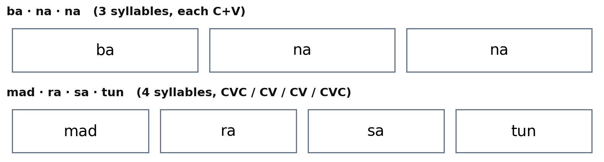
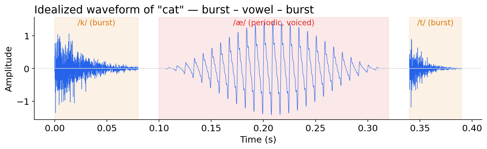
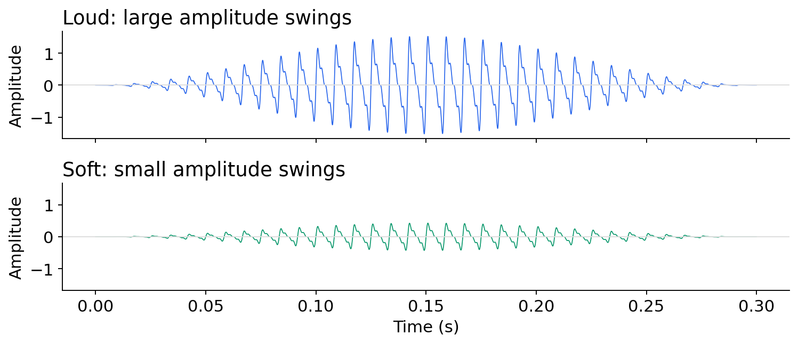
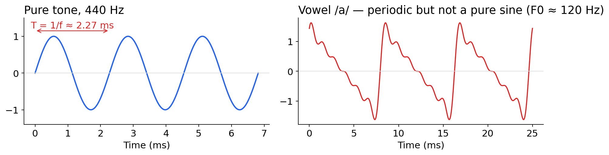
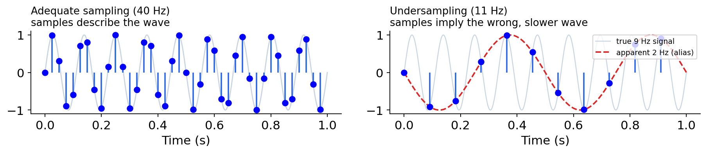
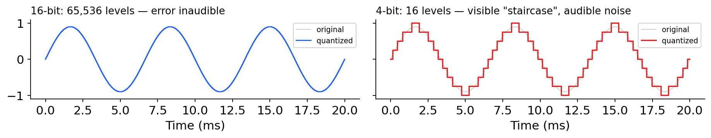
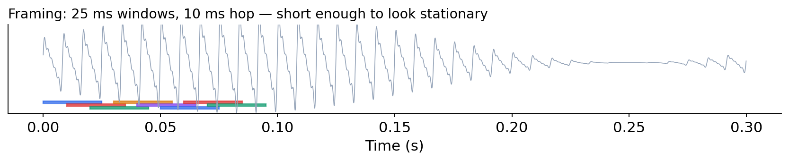
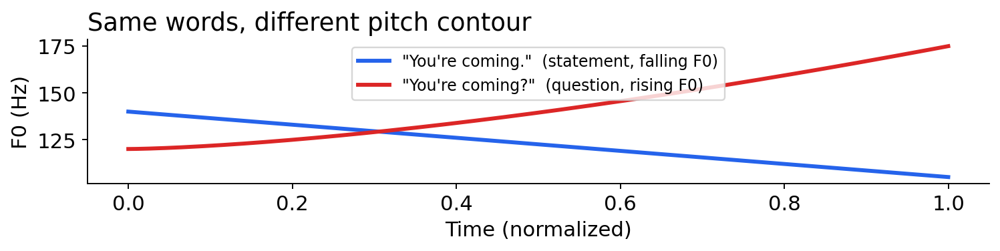
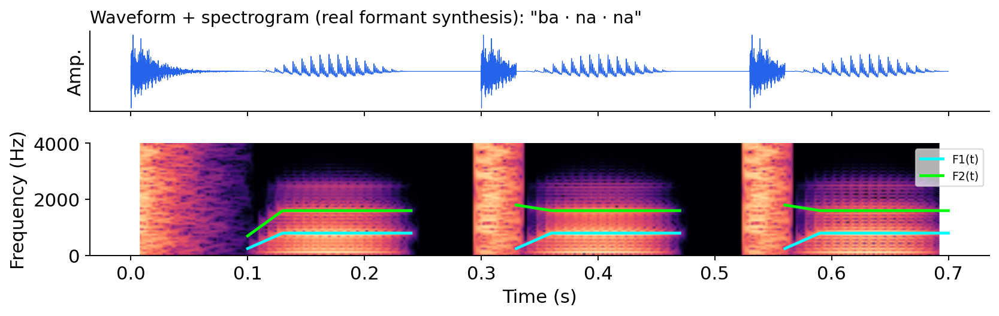

# Speech Recognition   (DSAI 456)
## Lecture 2: Foundations

**Prof. Mohamed Ghalwash**
<Email v="mghalwash@zewailcity.edu.eg" />
_Zewail City University_

:: note ::

Lecture 2, Monday 28 September 2026.

---
layout: top-title
color: sky-light
align: lt
title: Today
---

:: title ::

# Agenda

:: content ::

**Objectives**: by the end of this lecture you should be able to name the parts of a syllable, read amplitude/frequency/period off a waveform, explain what sampling and quantization actually do to a signal, distinguish pitch/loudness/intensity/F0, and read formants off a spectrogram.

- **Linguistic units**: syllable, vowel, consonant
- **Acoustics**: waveform, amplitude, frequency, Hertz, period
- **Digitization**: sampling, quantization, framing
- **Describing the signal**: pitch, loudness, intensity, F0
- **Formants**: why vowels sound different
- **Spectrogram**: putting all of it into one picture

---
layout: top-title
color: light
align: lt
title: Recap
---

:: title ::

# Recap: Last Week

:: content ::

- A speech signal is 16,000 numbers a second with no boundaries marked between words.
- WER = (S + D + I) / N. It has no ceiling and it hides which errors matter.
- This week: what *is* that stream of numbers, physically and linguistically, before any model sees it?

---
layout: section
title: Syllables
---

# Part 1

## What Are We Trying to Recognize?

Syllables, vowels, consonants

---
layout: top-title
color: light
align: lt
title: Syllable structure
---

:: title ::

# Syllable = Onset + Nucleus + Coda

:: content ::

- A **syllable** is a single unbroken unit of spoken sound that contains exactly **one vowel** sound, with or without surrounding consonant sounds.
- The vowel at the core is the **nucleus** (every syllable has exactly one); consonants before it are the **onset**, after it the **coda**. Nucleus + coda = the **rime**.
- مَدْرَسَة (madrasa) splits into onset·nucleus syllables just like "banana" does.

---
layout: top-title-two-cols
color: light
columns: is-6
align: l-lt-lt
title: Vowel vs consonant
---

:: title ::

# Vowel vs. Consonant

:: left ::

## Vowels

- Open vocal tract, no major obstruction — always voiced.
- Carry the syllable nucleus; tend to be louder and longer.

<AdmonitionType type='important'>
Every language uses this vowel/consonant split, but how do I tell them apart on a waveform?
</AdmonitionType>

:: right ::

## Consonants

- Some constriction of the airflow (lips, tongue, teeth).
- Voiced (/b/, /n/) or voiceless (/p/, /s/); plosive, fricative, or nasal.

---
layout: section
title: Acoustics
---

# Part 2

## What Sound Physically Is

Waveform, amplitude, frequency, Hertz, period

---
layout: top-title-two-cols
color: light
columns: is-6
align: l-lt-cm
title: Waveform
---

:: title ::

# The Waveform

:: left ::

- Speech is air pressure changing over time. The **waveform** plots that pressure (y-axis) against time (x-axis).
- A pure tone is a sine wave: $y = A \sin(2\pi f t)$
- Real speech is a sum of many such waves at once — that's what makes it look messy, not random.
- Silence, a vowel, and a consonant each leave a visually distinct signature.

:: right ::

Idealized waveform for **"cat"**: burst (/k/), a periodic, voiced stretch (/æ/), then a second burst (/t/).

---
layout: top-title
color: light
align: lt
title: Amplitude
---

:: title ::

# Amplitude

:: content ::

- **Amplitude** is the size of the pressure swing — how far the waveform deflects from zero.
- Larger amplitude → louder sound (we'll formalize "loud" as intensity shortly).
- The same word, spoken loud vs. soft, has the same *shape* but a different *scale*.

---
layout: top-title-two-cols
color: light
columns: is-6
align: l-lt-cm
title: Frequency, Hz, period
---

:: title ::

# Frequency, Hertz, Period

:: left ::

- **Frequency** ($f$): how many cycles of the wave happen per second.
- **Hertz (Hz)**: the unit of frequency — 1 Hz = 1 cycle/second.
- **Period** ($T$): the time for *one* cycle to complete: $T = 1/f$.
- A pure 440 Hz tone repeats every $1/440 \approx 2.27$ ms.
- Speech is **not** a pure tone — it's periodic-*ish*, a sum of a fundamental frequency plus its harmonics (multiples of it).

:: right ::

---
layout: section
title: Digitization
---

# Part 3

## From Continuous Sound to Numbers

Sampling, quantization, framing

---
layout: top-title
color: light
align: lt
title: Sampling
---

:: title ::

# Sampling

:: content ::

- The waveform is **continuous** — infinitely many values in any interval. A computer can't store that, so **sampling** measures the amplitude at regular intervals and keeps only those points.
- **Sampling rate**: samples/second (Hz). Microphone data: **16 kHz**; telephone speech: **8 kHz**.
- Sampling too slowly creates a false lower-frequency wave (aliasing), and it causes audible distortion.

<AdmonitionType type='important'>
Sample fast enough to capture the frequencies that matter — mostly below 8 kHz for speech intelligibility, which is why 16 kHz is standard.
</AdmonitionType>

---
layout: top-title
color: light
align: lt
title: Quantization
---

:: title ::

# Quantization

:: content ::

- Bit: the basic unit of digital storage — a single binary digit, either 0 or 1. n bits can represent 2ⁿ distinct values, so more bits = more possible amplitude levels to round to. 
- Bit depth is simply how many bits are used per sample.
- Quantization measures how precisely each amplitude is rounded to one of a fixed number of levels, set by the **bit depth**.
- 16-bit audio → 65,536 levels, rounding error (**quantization noise**) far too small to hear.
- Fewer bits → fewer levels → a visible "staircase" and audible noise.

---
layout: top-title
color: light
align: lt
title: Framing
---

:: title ::

# Framing

:: content ::

- Speech is **non-stationary** — its frequency content changes constantly, but most analysis techniques (starting next week: DFT/FFT) assume the signal is stationary over the window they look at.
- Solution: **framing** — cut the signal into short, overlapping windows (~25 ms, sliding by ~10 ms), short enough to look roughly stationary inside each one.
- Overlap ensures we don't miss anything that falls near a frame boundary.

<AdmonitionType type='tip'>
"Frame length and hop size" reappear in exactly this form for STFT and MFCCs next week.
</AdmonitionType>

---
layout: section
title: Describing the signal
---

# Part 4

## Describing What We Hear

Pitch, loudness, intensity, F0

---
layout: top-title # -two-cols
color: light
# columns: is-6
# align: l-lt-lt
title: Pitch, loudness, intensity
---

:: title ::

# Pitch, Loudness, Intensity

:: content ::

- **Intensity**: the physical energy of the sound wave — proportional to amplitude squared ($I \propto A^2$). Measured in decibels (dB).
- **Loudness**: our *perception* of intensity. Related to intensity, but not identical — perception is nonlinear and frequency-dependent.
- **Pitch**: our *perception* of frequency — how high or low a sound seems. Related to frequency, but subjective.

<!-- :: right :: -->

- **F0 (fundamental frequency)**: the physical measurement most closely underlying perceived pitch — the lowest, dominant frequency of a periodic waveform (the rate the vocal folds vibrate at).

<AdmonitionType type='note'>
Keep the pattern straight: <strong>F0/intensity</strong> are what we measure from the signal; <strong>pitch/loudness</strong> are what a listener experiences. They correlate strongly but are not the same thing.
</AdmonitionType>

---
layout: top-title
color: light
align: lt
title: F0 contour
---

:: title ::

# F0 Over Time: the Pitch Contour

:: content ::

- F0 isn't a single number for a whole utterance — it changes continuously. Tracking it frame-by-frame gives a **pitch contour** (or **pitch track**).
- The same words, said with a different pitch contour, can mean something different.

<AdmonitionType type='note'>
<strong>RMS (root-mean-square) amplitude</strong> — the standard frame-level measurement of intensity, computed the same frame-by-frame way as F0.
</AdmonitionType>

---
layout: section
title: Formants
---

# Part 5

## Why Vowels Sound Different

The source-filter model, F1 and F2

---
layout: top-title
color: light
align: lt
title: Source-filter model
---

:: title ::

# The Source–Filter Model

:: content ::

- **Source**: the vocal folds vibrate, producing a buzz-like sound rich in harmonics (multiples of F0).
- **Filter**: the vocal tract (throat, mouth, nose) is a resonant cavity whose *shape* — set by tongue position, jaw, lips — amplifies some frequencies and damps others.
- Change the vocal tract shape (move your tongue) without changing the source (F0), and you change which frequencies come through loudest — that's what turns the same buzz into different vowels.
- The frequencies the vocal tract resonates at, and therefore amplifies, are called **formants**.

<AdmonitionType type='tip'>
Say "ee" then "ah" while gently touching your throat — the buzz (source) barely changes, but the sound changes completely. That's the filter doing the work.
</AdmonitionType>

---
layout: top-title
color: light
align: lt
title: F1 and F2
---

:: title ::

# What F1 and F2 Actually Are

:: content ::

- Formants are numbered by frequency, lowest first: **F1** is the vocal tract's *lowest* resonant frequency, **F2** the *next* one up (F3, F4, … exist too, but F1/F2 carry most of the information that distinguishes vowels).
- On a spectrogram, formants appear as the darkest horizontal bands above F0 — literally the frequency ranges the vocal tract let through the loudest.
- **F1 correlates with tongue height**: high tongue (e.g. "ee") → low F1; low tongue (e.g. "ah") → high F1.
- **F2 correlates with tongue frontness/backness**: front tongue (e.g. "ee") → high F2; back tongue (e.g. "oo") → low F2.
- This means F1/F2 aren't arbitrary numbers — they're a direct readout of where your tongue was.

---
layout: section
title: Spectrogram
---

# Part 6

## Putting It All Together

The spectrogram

---
layout: top-title
color: light
align: lt
title: Spectrogram
---

:: title ::

# The Spectrogram

:: content ::

- A **spectrogram** is a picture of sound: time on the x-axis, frequency on the y-axis, darkness/color showing energy.
- Readable in one picture: **voiced** regions (formant bands, dark low down), **bursts** (a vertical smear), **silence** (blank), **formants** (dark horizontal bands — F1 low, F2 above).

---
layout: section
title: Conclude
---

# Part 7

## Conclude 

---
layout: top-title
color: light
align: lt
title: Summary
---

:: title ::

# What to Take Away

:: content ::

- A syllable is onset + nucleus (vowel) + coda; vowels are open and voiced, consonants involve some constriction.
- Waveform = pressure over time; amplitude = size of the swing; frequency (Hz) = cycles/second; period = 1/frequency.
- **Sampling** discretizes time (16 kHz standard; too slow → aliasing). **Quantization** discretizes amplitude (16-bit standard). **Framing** cuts the signal into short, near-stationary windows.
- Intensity/F0 are physical measurements; loudness/pitch are what we perceive.
- **F1** tracks tongue height, **F2** tracks tongue frontness — together they place a vowel in the vowel space, all visible at once in a **spectrogram**.

Next week: how a spectrogram is actually computed — DFT, FFT, windowing, and the mel scale.

---
layout: top-title
color: sky-light
align: lt
title: Assignment 2
---

:: title ::

# Assignment 2: Due Next Week

:: content ::

Go back to **your own Assignment 1 recording** (the sentence you recorded and computed WER on).

1. **Plot it**: waveform, short-time (RMS) energy/intensity, and F0 contour. Mark voiced vs. unvoiced regions.
2. **Measure formants**: pick 2–3 vowels, measure F1/F2 (librosa).
3. **Annotate a spectrogram** by hand — mark formant bands, bursts, and silence.
4. **Degrade it**: downsample (16k → 8k → 4k) and requantize (16-bit → 8-bit → 4-bit); re-run each through your Assignment 1 ASR system and recompute WER.
5. **Report**: plot WER vs. sampling rate / bit depth. Where does degradation become *audible*, and where does the ASR system actually *break*? Do those points coincide?

---
layout: section
title: Questions
class: text-center
---

# Learn More

[Course Homepage](https://github.com/m-fakhry/DSAI-456-Speech) · [J&M Ch. 16](https://web.stanford.edu/~jurafsky/slp3/) · [WASP](https://www.speechandhearing.net/laboratory/webtools.php) · [Chrome Music Lab: Spectrogram](https://musiclab.chromeexperiments.com/Spectrogram/)
