# Speech Recognition   (DSAI 456)
## Lecture 3: Spectral Front End

**Prof. Mohamed Ghalwash**
<Email v="mghalwash@zewailcity.edu.eg" />
_Zewail City University_

:: note ::

Lecture 3, Monday 5 October 2026.

---
layout: top-title
color: sky-light
align: lt
title: Today
---

:: title ::

# Agenda

:: content ::

**Objectives**: by the end of this lecture you should be able to compute DFT bin frequencies and resolution, explain why we window frames and what spectral leakage is, describe what the STFT and the spectrogram contain (and their shapes), build a log-mel spectrogram step by step, and say why each step of the MFCC pipeline exists.

- **The frequency domain**: DFT and FFT
- **Frames and windows**: framing, leakage, Hamming and Hann
- **STFT and spectrogram**: the time-frequency trade-off
- **Mel and log**: mel scale, filterbank, dB vs. mel, log-mel
- **MFCC**: reading homework 
- **The whole pipeline**: waveform to features

---
layout: top-title
color: light
align: lt
title: Recap
---

:: title ::

# Recap: Last Week

:: content ::

- Speech is 16,000 numbers per second. We need to cut it into frames because it is non-stationary.
- A **spectrogram** shows formants, bursts, and silence in one picture.
- Today: how is that picture *computed*, and what do we feed a model instead of raw samples?

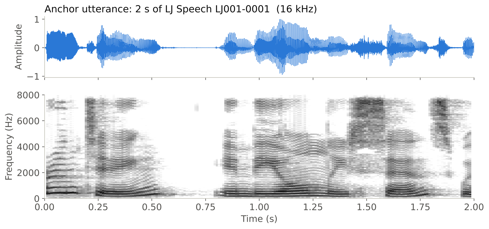

<!-- <AdmonitionType type='note'>
<strong>Anchor utterance</strong> for today: the first 2 s of LJ001-0001 from the public-domain LJ Speech corpus. Every figure uses it, so you can follow one signal through the whole pipeline.
</AdmonitionType> -->

---
layout: section
title: Frequency domain
---

# Part 1

## The Frequency Domain

Fourier Transform 

---
layout: top-title
color: light
align: lt
title: Sum of sines
---

:: title ::

# Any Wave Is a Sum of Sines

:: content ::

- **Fourier's insight**: every signal can be written as a sum of sine waves with different frequencies, amplitudes, and phases.
- The **spectrum** lists which frequencies are present and how strong each one is.
- A spectrum is another *representation* of the same signal.

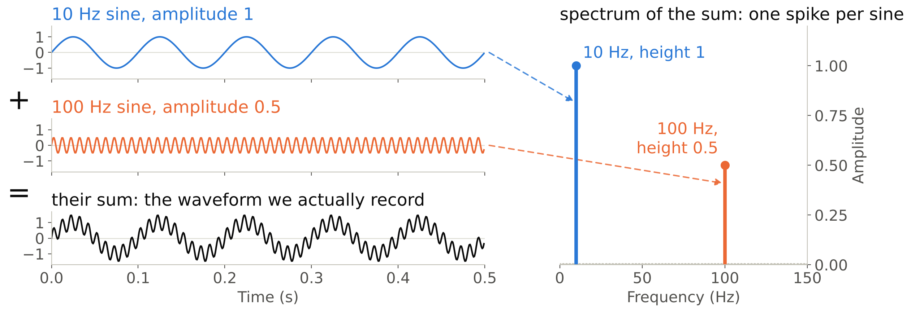

---
layout: top-title
color: light
align: lt
title: The DFT
---

:: title ::

# Discrete Fourier Transform (DFT)

:: content ::

$$X[k] = \sum_{n=0}^{N-1} \underbrace{x[n]}_{\text{frame of } N \text{ samples}} \cdot \underbrace{e^{-j 2\pi k n / N}}_{\text{probe wave: } k \text{ cycles per frame}}$$

- **Read it as**: multiply frame and probe sample by sample, then add up: a **large** sum if the frame contains that frequency; otherwise they cancel.
- $|X[k]|$ = **how much** of that frequency is present.

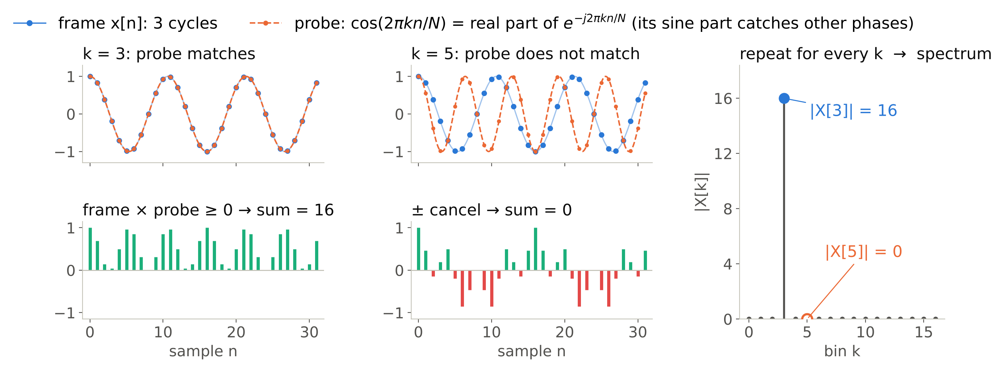

---
layout: top-title
color: light
align: lt
title: FFT
---

:: title ::

# Fast Fourier Transform (FFT)

:: content ::

- The **FFT** computes exactly the same DFT in $O(N \log N)$ instead of $O(N^2)$ operations.
- The (radix-2) FFT needs $N$ to be a power of 2. 
  - If $L = 400$ samples per frame then $N = 2^9 = 512$ (Whisper uses $N = 400$).
  - We **zero-pad** with 112 zeros. 
<!-- 
- **Bins**: bin $k$ sits at $k\,f_s/N$, so bins are $f_s/N = 31.25$ Hz apart. The upper half mirrors the lower, so we keep **257 bins** ($k = 0,\dots,N/2$): 0 to 8 kHz. 
- Zero-padding adds closer bins but **no new information**: resolution is set by the 400 real samples.
-->

---
layout: section
title: Frames and windows
---

# Part 2

## Frames and Windows

Framing, leakage, Hamming and Hann

---
layout: top-title
color: light
align: lt
title: Why one DFT is not enough
---

:: title ::

# Why One DFT of the Utterance Is Not Enough

:: content ::

- The *magnitude* spectrum of the whole 2 s utterance says *which* frequencies occurred, but not *when*: the timing is hidden in the phase, which we discard, so every vowel is mixed together.
- A DFT of one short vowel frame shows its harmonics and the formant peaks that identify the phone.
- So we compute **one spectrum per short frame**, where the signal is roughly stationary.

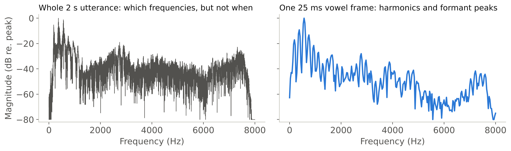

---
layout: top-title
color: light
align: lt
title: Framing
---

:: title ::

# Framing: Frame Length and Hop

:: content ::

- **Frame length** $L$ (window size): 25 ms. **Hop** $H$ (stride): 10 ms, so consecutive frames overlap by 15 ms.
- At $f_s = 16$ kHz: $L = 400$ samples and $H = 160$ samples.
- A signal of $N_{tot}$ samples gives $T = 1 + \lfloor (N_{tot} - L) / H \rfloor$ frames.
- Our 2 s anchor is 32,000 samples, so $T = 1 + \lfloor 31600 / 160 \rfloor = 198$ frames.

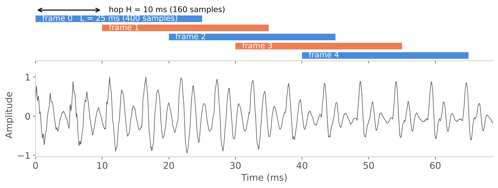

---
layout: top-title
color: light
align: lt
title: Windowing
---

:: title ::

# Windowing: Cutting Out a Frame

:: content ::

- Extracting a frame means multiplying the signal $s[n]$ by a **window** $w[n]$ that is zero outside the frame:

$$y[n] = w[n]\, s[n]$$

- The simplest window is **rectangular**: keep the samples as they are inside the frame, zero elsewhere.

$$w_{\text{rect}}[n] = \begin{cases} 1 & 0 \le n \le L-1 \\ 0 & \text{otherwise} \end{cases}$$

- Cutting a frame with a rectangular window is what we implicitly did so far. It has a hidden cost.

<AdmonitionType type='important'>
The DFT treats the frame as one period of a signal that repeats forever. If the two edges do not match, the repeated signal has a jump.
</AdmonitionType>

---
layout: top-title
color: light
align: lt
title: Spectral leakage
---

:: title ::

# Spectral Leakage

:: content ::

- DFT bins sit at **whole numbers of cycles per frame**: bin $k$ = exactly $k$ cycles.
- **3 cycles** (left) lands on bin 3: the copies join smoothly → **one clean spike**.
- **3.5 cycles** (right) falls between bins 3 and 4: the copies meet with a **jump**, which needs many frequencies to describe → the energy **leaks** into every bin.

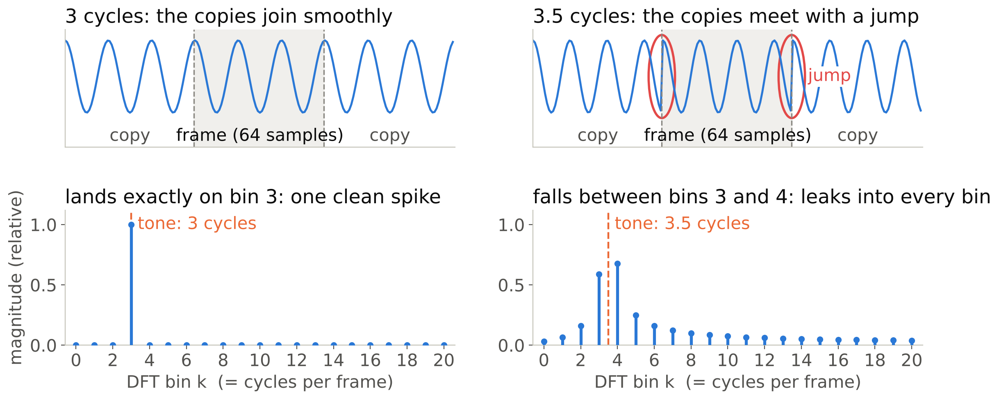

---
layout: top-title
color: light
align: lt
title: Window shapes
---

:: title ::

# Window Shapes: Hamming and Hann

:: content ::

Taper the frame toward zero at both edges, so the copies meet with (almost) no jump:

$$w_{\text{Hamming}}[n] = 0.54 - 0.46\cos\!\Big(\tfrac{2\pi n}{L}\Big), \qquad w_{\text{Hann}}[n] = 0.5 - 0.5\cos\!\Big(\tfrac{2\pi n}{L}\Big)$$

for $0 \le n \le L-1$ (the periodic form, as in librosa; some toolkits divide by $L-1$).

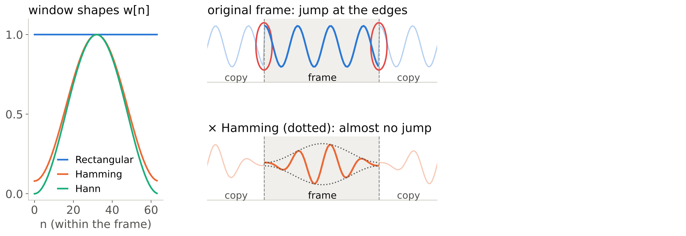

- The price: the main lobe gets **wider** (slightly blurrier frequency), but the side lobes drop a lot.

---
layout: section
title: STFT and spectrogram
---

# Part 3

## STFT and the Spectrogram

Stacking spectra over time

---
layout: top-title
color: light
align: lt
title: STFT
---

:: title ::

# Short-Time Fourier Transform (STFT)

:: content ::

Put framing, windowing, and the DFT together. For frame index $m$ and bin $k$:

$$X[m,k] = \sum_{n=0}^{L-1} w[n]\, x[mH + n]\, e^{-j 2\pi k n / N}$$

1. Take the $L$ samples starting at $mH$.
2. Multiply them by the window $w[n]$.
3. Zero-pad to $N$ samples and take the DFT.
4. Move forward by $H$ samples and repeat.

The result is a complex matrix with one row per frame and one column per bin.

<AdmonitionType type='important'>
Frame length <em>L</em> and hop <em>H</em> are the same ones from last week, now with a formula behind them.
</AdmonitionType>

---
layout: top-title
color: light
align: lt
title: Spectrogram
---

:: title ::

# From STFT to Spectrogram

:: content ::

- Keep the magnitude and put it on a decibel scale, $S[m,k] = 20 \log_{10} |X[m,k]|$, so quiet parts stay visible (why the log helps: Part 4).
- A spectrogram is **one spectrum per frame, placed side by side**.
- Shape: $T \times (N/2 + 1)$.

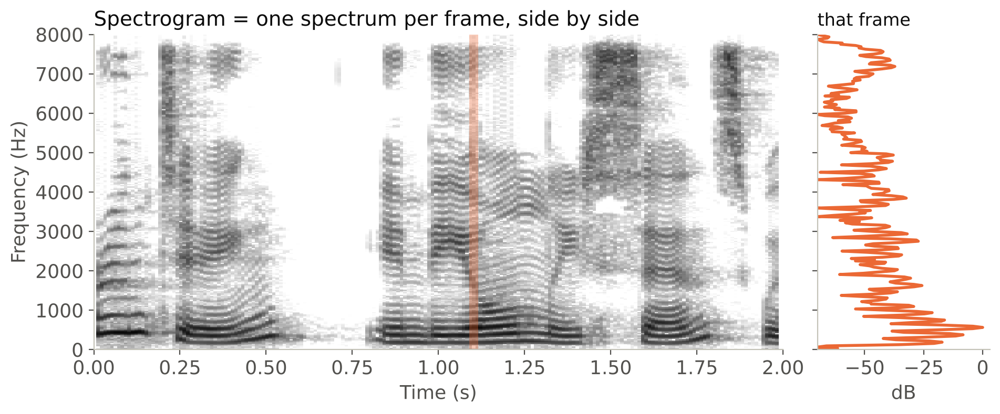

---
layout: top-title
color: light
align: lt
title: Time-frequency trade-off
---

:: title ::

# The Time–Frequency Trade-off

:: content ::

- **You cannot have both**: a short window is sharp in time and blurry in frequency, a long window the opposite.

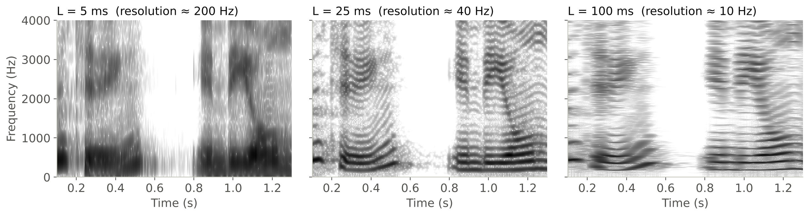

<AdmonitionType type='important'>
Same signal, same hop. Only the window length changed: 5 ms, 25 ms, 100 ms.
</AdmonitionType>

---
layout: section
title: Mel and log
---

# Part 4

## The Mel Filterbank and the Log

From 257 linear bins to 80 perceptual channels

---
layout: top-title-two-cols
color: light
columns: is-6
align: l-lt-cm
title: The mel scale
---

:: title ::

# Why Mel? The Mel Scale

:: left ::

- Pitch perception is roughly **linear below 1 kHz and logarithmic above**: 200 → 300 Hz is a big step (119 mel), 6200 → 6300 Hz a small one (16 mel).
- The **mel scale** puts equal perceived pitch steps at equal distances:

$$\text{mel}(f) = 1127 \ln\!\Big(1 + \frac{f}{700}\Big)$$

- 1000 Hz ≈ 1000 mel; 8000 Hz ≈ 2840 mel.

:: right ::

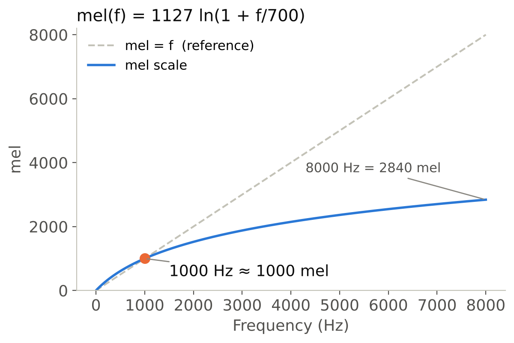

---
layout: top-title
color: light
align: lt
title: Mel filterbank
---

:: title ::

# The Mel Filterbank

:: content ::

1. Choose $M = 12$ channels. Place $M + 2$ points **equally spaced in mel** from 0 to 8000 Hz (0 to 2840 mel), then convert back: $f = 700\,(e^{\,\text{mel}/1127} - 1)$.
2. Filter $m$ is a **triangle** from point $m$ to point $m+2$, with weight 1 at point $m+1$.
3. Each channel adds up the power under its triangle: $E_m[t] = \sum_k H_m[k]\, |X[t,k]|^2$. For all frames at once this is one matrix product: $(198 \times 257)\cdot(257 \times 12) \rightarrow 198 \times 12$.

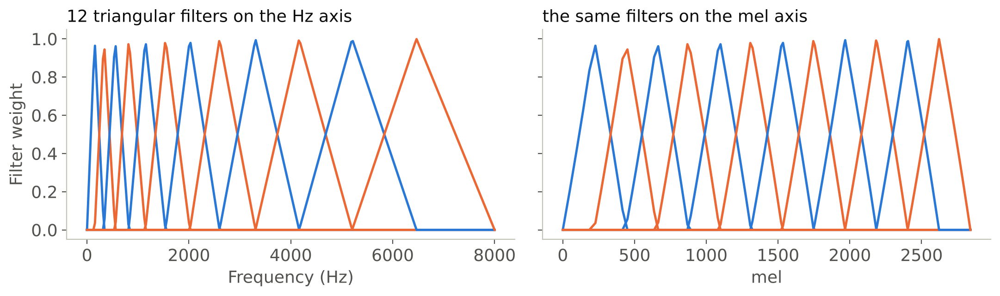

<AdmonitionType type='note'>
Equal width in mel = narrow filters at low Hz, wide ones at high Hz.
</AdmonitionType>

---
layout: top-title-two-cols
color: light
columns: is-6
align: l-lt-cm
title: The log
---

:: title ::

# The Log Scales

:: left ::

- Two log-like scales on **two different axes**:
  - **mel** warps the **frequency** axis (pitch);
  - **dB / log** compresses the **energy** axis (loudness).
- Log step: $\log\big(E_m[t] + \epsilon\big)$, or $10\log_{10} E_m[t]$ in dB ($\epsilon$ avoids $\log 0$).
- **Dynamic range**: a vowel can carry ~30 dB (1000×) more power than a weak fricative; on a linear scale only the loudest spots show (top row).

:: right ::

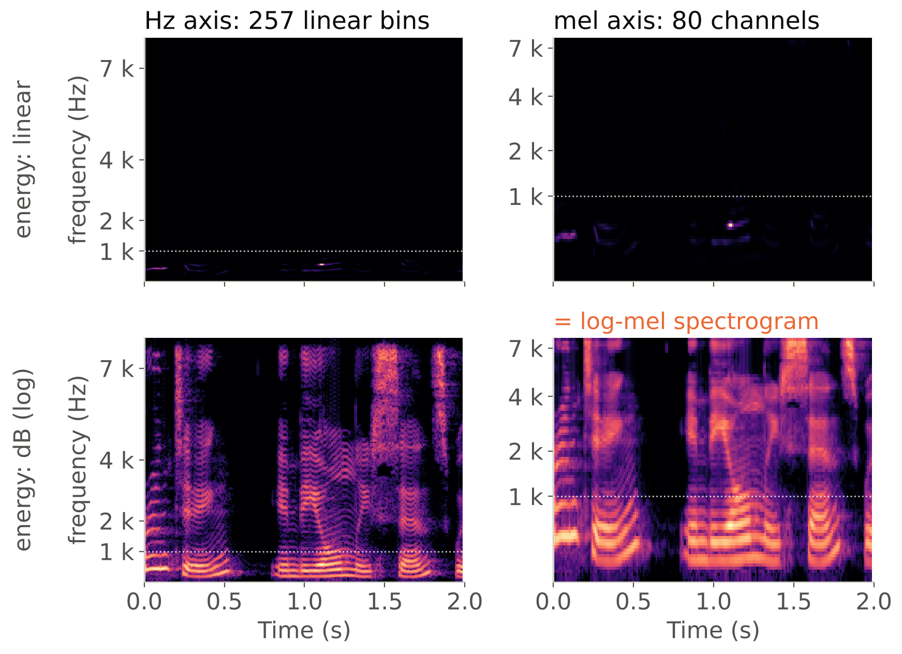

---
layout: top-title
color: light
align: lt
title: Log-mel
---

:: title ::

# Log-Mel: The Standard Neural Input

:: content ::

`waveform → frame → window → |DFT|² → mel filterbank → log`

- The output is a **log-mel spectrogram**: one vector of 80 (or 128) channels per 10 ms frame.
- Before the network, features are usually **normalized**: zero mean and unit variance (per utterance or over the training set), or a fixed rescaling to about $[-1, 1]$ (Whisper).
- The encoders in Weeks 5–9 (CTC models, Conformer, wav2vec 2.0 and later) start from this representation or learn something similar directly from the waveform.

---
layout: section
title: MFCC
---

# Part 5

## MFCC

Intuition only (details: reading homework)

---
layout: top-title
color: light
align: lt
title: MFCC idea
---

:: title ::

# MFCC: Keep the Envelope, Drop the Pitch

:: content ::

- **Source–filter** (Lecture 2): a vowel's spectrum is a fast **ripple** from the vocal folds (pitch) on a smooth **envelope** from the vocal tract. The phone is in the envelope.
- **MFCC** (mel-frequency cepstral coefficients) describe the *shape* of each log-mel frame with only **13 numbers**: enough for the envelope, too few for the ripple (blue, right).
- With how they change over time: **39 per frame**. Compact and much less correlated than log-mel, they suit the GMM-HMMs of next week; neural models mostly use log-mel.

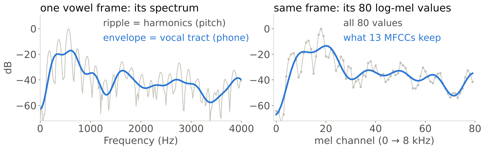

<AdmonitionType type='note'>
Details (cepstrum, DCT, deltas): reading homework, J&M Ch. 15.6.
</AdmonitionType>

---
layout: top-title
color: light
align: lt
title: MFCC vector
hide: true
---

:: title ::

# The 39-Dimensional MFCC, and MFCC vs. Log-Mel

:: content ::

- **13 static** features: $c_0$ (the energy term, ∝ average log energy) and $c_1, \dots, c_{12}$ (the envelope shape).
- **Deltas** capture change: $\Delta c_t = \frac{1}{10}\sum_{\tau=1}^{2} \tau\,(c_{t+\tau} - c_{t-\tau})$, and ΔΔ = Δ of Δ. 13 + 13 + 13 = **39 per frame**.

| | Log-mel | MFCC |
|---|---|---|
| Dimension | 80–128 | 13 (39 with Δ, ΔΔ) |
| Detail | all channels: the network learns what to keep | smooth envelope only |
| Correlation | high between neighbouring channels | low: suits diagonal-covariance GMMs (Week 4) |
| Typical use | neural encoders (Conformer, Whisper) | GMM-HMM, small or low-resource systems |

<AdmonitionType type='tip'>
On the full 9.6 s clip, mean |correlation| drops from 0.52 (40-channel log-mel) to 0.18 (c0–c12). In librosa (arrays are channels × frames): <code>librosa.feature.mfcc(S=logmel, n_mfcc=13)</code>; the default is 20.
</AdmonitionType>

---
layout: section
title: Conclude
---

# Part 6

## Conclude

---
layout: top-title
color: light
align: lt
title: The pipeline
---

:: title ::

# The Whole Pipeline, One Utterance

:: content ::

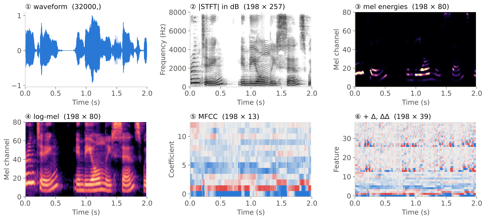

`198×400 frames → |DFT|² 198×257 → mel 198×80 → log → DCT 198×13 → +Δ,ΔΔ 198×39`

---
layout: top-title
color: light
align: lt
title: Check yourself
---

:: title ::

# Check Yourself

:: content ::

**1.** Put these steps in order: *log, mel filterbank, window, |DFT|², frame, DCT.*

<v-click>

frame → window → |DFT|² → mel filterbank → log → DCT (the last step is only for MFCC)

</v-click>

**2.** A 16 kHz signal, 25 ms window, 10 ms hop, 512-point FFT. What are the bin spacing, the number of bins, and the number of frames in a 3 s clip?

<v-click>

31.25 Hz, 257 bins, $1 + \lfloor (48000 - 400)/160 \rfloor = 298$ frames.

</v-click>

**3.** Why do we window?

<v-click>

Tapering removes the edge jump and so reduces leakage.

</v-click>

---
layout: top-title
color: light
align: lt
title: Summary
---

:: title ::

# What to Take Away

:: content ::

- The **DFT** measures how much of each frequency a frame contains.
- We analyze short **frames** ($L$ = 25 ms, $H$ = 10 ms). Windowing with **Hamming/Hann** removes the edge jump that causes **spectral leakage**.
- The **STFT** is the DFT of every windowed frame; the **spectrogram** is its magnitude in dB. 
- **Mel filterbank + log** gives log-mel: mel warps the frequency axis, the log (dB) compresses the energy axis. This is the standard neural input.
- **MFCC** keeps the vocal-tract envelope, drops most pitch detail, and decorrelates the features.

Next week: how do we model the *sequence* of these vectors? Alignment, HMMs, the forward algorithm, and Viterbi.

---
layout: top-title
color: sky-light
align: lt
title: Lab 3
---

:: title ::

# Assignment 3: Build the Front End

:: content ::

In the lab you will build the pipeline from this lecture.

1. **Frame and window** a recording yourself (NumPy only): check the frame count against the formula.
2. **STFT and spectrogram**: compute the DFT per frame and compare with `librosa.stft`. It returns bins × frames and pads by default ( `center=False` and `n_fft=512`).
3. **Mel filterbank**: build the triangular filters and apply them, then take the log.
4. **MFCC**: keep 13 coefficients and add Δ and ΔΔ.
5. **Explore**: vary the window length and the window type, and describe what changes.

<AdmonitionType type='tip'>
Reading: J&M Ch. 15.5.2–15.6 (windowing, DFT, mel filter bank and log, MFCC); review Ch. 15.4.5 from last week.
</AdmonitionType>

---
layout: section
title: Questions
class: text-center
---

# Learn More

[Course Homepage](https://github.com/m-fakhry/DSAI-456-Speech) · [J&M Ch. 15](https://web.stanford.edu/~jurafsky/slp3/15.pdf) · [librosa: melspectrogram](https://librosa.org/doc/latest/generated/librosa.feature.melspectrogram.html) · [HuggingFace Audio Course](https://huggingface.co/learn/audio-course) · [Chrome Music Lab: Spectrogram](https://musiclab.chromeexperiments.com/Spectrogram/) · [But what is the Fourier Transform? A visual introduction](https://www.youtube.com/watch?v=spUNpyF58BY)
